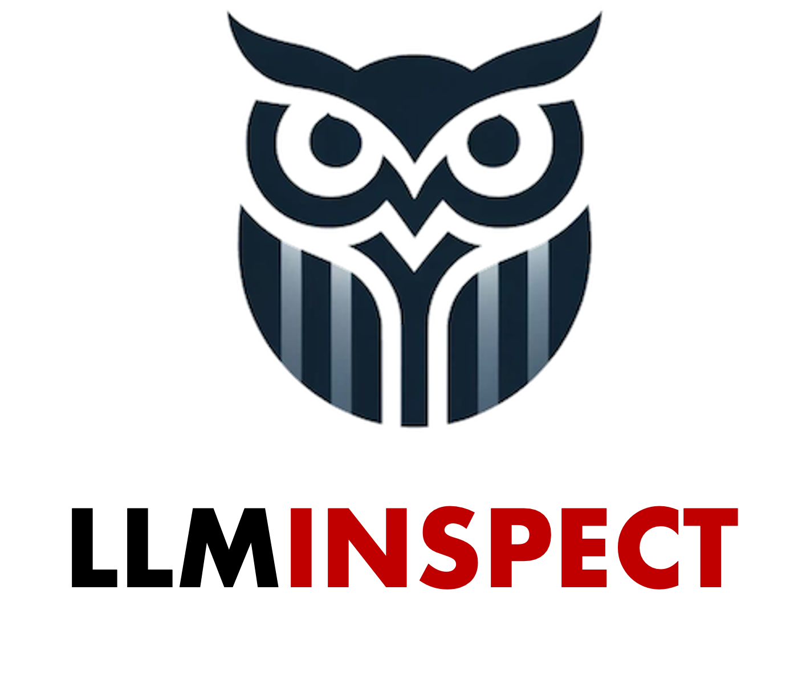
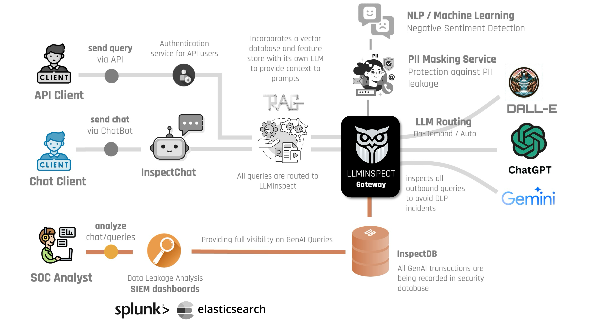

  

  

## LLMInspect - An AI Gateway
With the recent rise of GenAI, most of the enterprises want to use LLMs to enhance their productivity, by enabling their employees to grant them access to public LLM providers (like **ChatGPT**, **Gemini**, **Anthropic**, etc). Though this definitely improves the overall productivity of the employees in their routine operations, however this capability posses several threats to the enterprise as mployees are sharing the intellectual property of the organization with these public entities, and thus opening a new avenue of data leakage threats.

**LLMInspect** GenAI Gateway from <a href="https://eunomatix.com">**EUNOMATIX**</a> is a one stop solution to all those problems, as it massively enhances the enterprise AI experience and cyber safety. From one application users can interact with different public and private LLM models, and control what is being sent to these models. Using **LLMInspect**, SOC Analysts can also view the employee GenAI usage and discover any LLM related Security Threats. **LLMInspect** also brings very interesting capabilities to its users, e.g. rate limit the GenAI queries or even re-route external LLM queries to enterprise's private LLMs.

  

## Architecture
LLMinspect is designed from the ground up keeping in mind the requirements of modern enterprise deployments. Based on the principles of **service-oriented architecture**, LLMinspect can be comfortably deployed both in the cloud and on-prem, and easily scalable on emerging business needs. LLMinspect enables clients from various modalities to interact with public LLM providers in a safe and secure manner such as chat clients using our flexible web interface which allows a user to fully exercise various features of LLMs for example conversational AI image generation, code generation and retrieval augmented generation. Regardless of the source all LLM interactions are guarded and logged by LLMInspect. 

Once the requests reach LLMInspect, LLMinspect masks all **personally identifiable information (PII)** so that such information will not leave the enterprise premises in parallel our sentiment analysis service detects and logs the sentiment of the text. During this process detailed logs, chat text, images as well as transaction metadata are kept for analysis in the InspectDB service. 

    

## Features
- **Simple GUI**: ChatGPT like GUI including Light and Dark Modes
- **Multimodal Chat**: Upload and analyze images and leverage advanced agents with tools and API actions
- **Multilingual UI**: Support for multiple languages
- **Model Selection**: OpenAI, Azure, Anthropic, Google, and more
- **Multi-User Support**: Integrates with LDAP, Active Directory and OpenID
- **Flexible Deployment**: Proxy, Reverse Proxy, Docker, etc
- **Searching**: Search all Messages and conversations
- **Export**: Conversations in various formats (Markdown, JSON, etc)

## Integration with Retrieval Augmented Generation (RAG)
LLMinspect AI Gatways also includes an embedded indentity-aware <a href="https://eunomatix.com/site/web/products-inspectrag.html">**SecureRAG**</a>, where users can upload custom documents to enhance an LLMs response or process. SecureRAG is quite intelligent and supports integration with enterprise data repositories (e.g. **Sharepoint**, **Google Drive**, etc.) in conjunction with the enterprise identity provider (**IdP**) to ensure that document access is safe, secure and only authorized users are able to access their respective documents in the RAG store.

## Security Guardrails
LLMInspect guardrails refer to safety mechanisms or guidelines put in place to control, constrain, or guide the behavior of large language models like ChatGPT or Gemini, ensuring they are used responsibly and ethically. These guardrails help prevent harmful outputs, mitigate risks of misinformation, and ensure that interactions are safe, aligned with ethical standards, and useful.

- **Negative Sentiment Guardails**
- **PII & BII Guardrail**
- **Anti-Jailbreak Guardrail**
- **Prompt Classifier Guardrail**
- **Business-Specific Guardrails**

## Advanced Features
To increase observability effectiveness LLMInspect provides plugins for easy integration with splunk and elastic. These plugins reduced the need for custom tooling and seamlessly integrate with existing SOC (security operation center) solutions. SIEM dashboards provide by LLMinspect enable SOC analysts to analyze this information. Finally, the masked text is sent to the upstream LLM of user’s choice.    

## Contact us
Reach out LLLMInspect Sales Teams for free demo/trail, by emailing [sales@eunomatix.com](mailto:sales@eunomatix.com)

[![CC BY 4.0][cc-by-shield]][cc-by]

This work is licensed under a
[Creative Commons Attribution 4.0 International License][cc-by].

[![CC BY 4.0][cc-by-image]][cc-by]

[cc-by]: http://creativecommons.org/licenses/by/4.0/
[cc-by-image]: https://i.creativecommons.org/l/by/4.0/88x31.png
[cc-by-shield]: https://img.shields.io/badge/License-CC%20BY%204.0-lightgrey.svg
